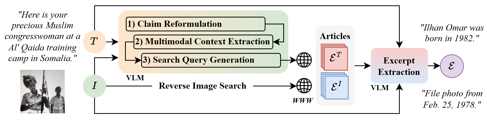
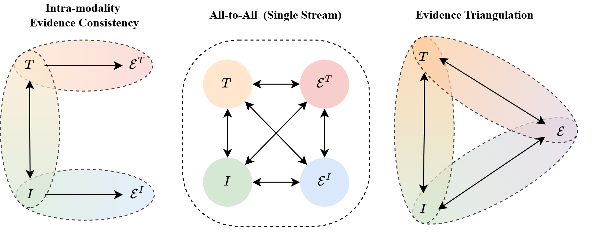

# Evidence Triangulation for Multimodal Fact-Checking in the Wild 

Repository for "Evidence Triangulation for Multimodal Fact-Checking in the Wild", accepted at the **European Conference on Computer Vision (ECCV 2026)**. 
Contains code for the **TRENT** architecture and the construction of the **X-POSE** dataset. 

📄 **Pre-print** available at [arXiv:2606.31367](https://arxiv.org/abs/2606.31367).  

🤗 The **X-POSE** dataset (claims, images, data splits, full articles, extracted excerpts) can be accessed through [Hugging Face](https://huggingface.co/datasets/stefpapad/X-POSE). \
*NOTE: An official academic or research institution email address is required for verification.*

## Abstract
>*The proliferation of multimedia content on social platforms has fueled multimodal misinformation, where images are used to reinforce false claims. Consequently, Multimodal Fact-Checking (MFC) has emerged as an increasingly important research area. However, current progress is hindered by a reliance on synthetic training data and curated benchmarks that fail to capture the complexity of in-the-wild data. Furthermore, existing detection models rely on restricted intra-modality consistency or unconstrained all-to-all fusion, failing to capture nuanced relations between posts and external evidence. To address these limitations, we introduce X-POSE, a benchmark of real-world, community-annotated multimodal posts from X (formerly Twitter), augmented with full-length news articles retrieved via VLM-optimized search. Additionally, we propose TRENT, a novel MFC model that performs evidence triangulation using three parallel cross-attention streams alongside a relational fusion mechanism that explicitly models entailment and contradiction. Extensive evaluations demonstrate that TRENT consistently outperforms state-of-the-art specialized models and commercial VLMs.*





## Contents
- `scripts/`: Data and evidence collection scripts. 
- `src/`: Core implementation (Model architecture, Dataset handling, Training/Evaluation).
- `data/`: The X-POSE dataset (Post IDs, Labels, and Metadata) and the processed outputs from the VLM (e.g., extracted evidence excerpts).
  
**NOTE**: In compliance with GDPR, platform Terms of Service, and Copyright Law, original images and raw article text not provided. Sections of the pipeline requiring these restricted assets are denoted as `INTERNAL` within the codebase.

## Data & Prompts
- **Community Notes Data:** Ratings used for Sections 4.1 and 4.4 were accessed via the [X Community Notes Data Portal](https://x.com/i/communitynotes/download-data).
- **Prompts:** All LLM/VLM prompts mentioned in the paper can be found in `src/vlm_prompts.py`, including:
    - **Section 4.2:** External Evidence Collection (Prompts 1-3)
    - **Section 4.3:** Evidence Excerpt Extraction (Prompt 4)
    - **Section 6:** VLM zero-shot detection (Prompt 6)
    - **Section 7.2:** Ablation Evidence Representation (Qwen GTE-7B) (Prompt 5)

---

## Section 4: Construction of X-POSE

- **Section 4.1: Data Collection and Annotation**
    - Identifies and extracts note-tweet pairs categorized as Factually Correct or Misleading, collects metadata and associated images.
    - Implementation: `scripts/dataset_building/`

- **Section 4.2: External Evidence Collection**
    - **Claim Reformulation & Context Extraction**: `scripts/feature_claim_extraction/`
    - **Search Query Extraction**: `scripts/query_generation/` 
    - **Evidence Retrieval & Scrapping**: `scripts/evidence_extraction/`

The end-to-end workflow for dataset construction is available at: `scripts/dataset_collection_pipeline.py`

- **Section 4.3: Evidence Excerpt Extraction**
```python
from src.prepare_evidence import evidence_excerpt_extraction
evidence_excerpt_extraction(DATA_PATH="data/")
```

- For Section 4.4 **Consensus-based Data Filtering**, see:
```python
from src.prepare_helpfulness_scores import calculate_helpfulness_scores
calculate_helpfulness_scores(DATA_PATH)
``` 
- The final `helpfulness_score.csv` (in `/data`) is utilized by `eval_agreement_subsets()` in `src/utils.py`

---

## Section 5: The TRENT Architecture

- Section 5.1: **Multimodal Representation** 
```python
from src.dataset import extract_features

# For X-POSE posts
extract_features(DATA_PATH="data/")

# For extracted Evidence Excerpts
extract_features(DATA_PATH="data/", evidence_excerpts=True)
```

- Section 5.2 **Evidence Reranking**
    - See the `DatasetIterator` in `src/dataset.py`, specifically the `rank_and_select()` function.

- Section 5.3 **Evidence Triangulation**
    - The TRENT architecture is defined in `src/models.py`, including the `CrossAttentionBlock()` and `relational_fusion()` components. 

---

## Inference and Training
To evaluate the pre-trained TRENT_FINAL model:
```python
from experiment import run_exp
run_exp(DATA_PATH="data/", 
        learning_rate=5e-5,
        topk_evidence=10, 
        TRAIN_MODEL=False, 
        model_name="TRENT_FINAL")
```

To reproduce the hyperparameter search for TRENT:
```python
for lr in [1e-4, 5e-5]:
    for k in [1, 3, 5, 10]:
        run_exp(DATA_PATH="data/", 
                topk_evidence=k, 
                learning_rate=lr, 
                TRAIN_MODEL=True)
```

## Acknowledgements
This work is partially funded by Horizon Europe projects AI-CODE and ELLIOT under grant agreement no. 101135437 and 101214398, respectively. 

## Licence
This project is licensed under the Apache License 2.0 - see the [LICENSE](https://github.com/stevejpapad/evidence-triangulation/blob/main/LICENSE) file for more details.

## Contact
Stefanos-Iordanis Papadopoulos (stefpapad@iti.gr)
